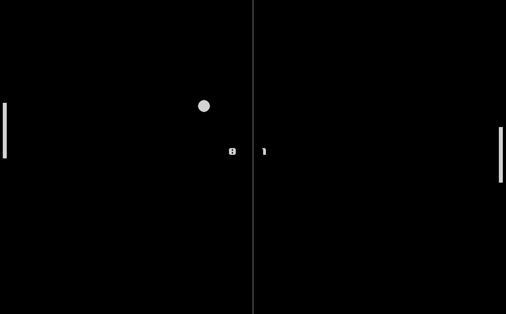

# PyPong

A classic Pong game built with Pygame, featuring clean architecture principles and modern Python 3.13.



## Features

- Classic Pong gameplay with AI opponent
- Clean architecture with separation of concerns
- Modern Python 3.13 with type hints
- Scene-based menu system
- Pause/resume functionality
- Options menu with volume control
- Smooth 60 FPS gameplay

## Requirements

- Python 3.13+
- [uv](https://github.com/astral-sh/uv) (modern Python package manager)
- pygame 2.6.0+

## Installation

1. Clone the repository:
```bash
git clone <repository-url>
cd pypong
```

2. Install dependencies using uv:
```bash
uv sync
```

## Running the Game

```bash
uv run python main.py
```

Or using uv directly:
```bash
uv run main.py
```

## Controls

### In-Game
- **UP/DOWN arrows**: Move Player 2 paddle
- **ESC**: Pause game
- **X button**: Close window

### In Menus
- **UP/DOWN arrows**: Navigate menu
- **ENTER**: Select option
- **ESC**: Go back / Return to main menu
- **LEFT/RIGHT arrows**: Adjust volume (in Options menu)

## Architecture

This project follows clean architecture principles with clear separation of concerns:

```
pypong/
├── domain/              # Pure game logic (no pygame dependencies)
│   ├── entities/       # Ball, Paddle, Score
│   ├── value_objects/  # Position, Velocity, Color, Dimensions
│   └── services/       # CollisionDetector, BallPhysics, ScoreManager
├── application/        # Use cases and orchestration
│   ├── use_cases/      # UpdateGame, HandleInput
│   ├── services/       # GameService, SceneManager
│   └── interfaces/     # Renderer, InputHandler, AssetLoader
├── infrastructure/     # Pygame-specific implementations
│   ├── rendering/      # PygameRenderer, FontManager
│   └── input/          # PygameInputHandler
└── presentation/       # Scenes and UI
    ├── scenes/         # MainMenuScene, GameScene, OptionsScene, etc.
    └── controllers/    # SceneController
```

### Key Principles

- **Domain Layer**: Completely pygame-free, fully testable
- **Application Layer**: Defines interfaces, orchestrates domain logic
- **Infrastructure Layer**: Implements pygame adapters
- **Presentation Layer**: Handles UI and user interaction

## Development

### Code Quality

The project uses [Ruff](https://github.com/astral-sh/ruff) for linting and formatting:

```bash
# Check code
uv run ruff check .

# Format code
uv run ruff format .
```

### Testing

Tests are organized by layer:

```bash
# Run all tests
uv run pytest

# Run specific test suite
uv run pytest tests/domain/
uv run pytest tests/application/
```

## Credits

Made by def12

## License

See [LICENSE](LICENSE) file for details.
